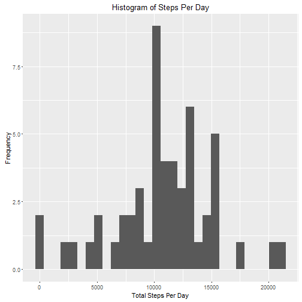
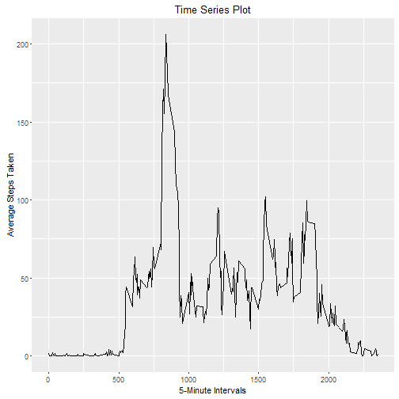
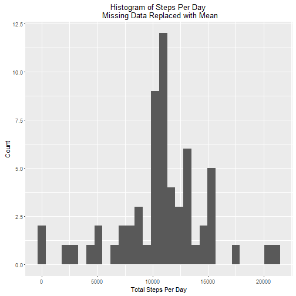
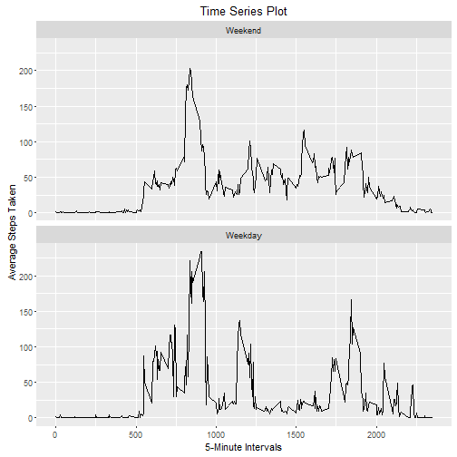

# Reproducible Research: Course Project 1  
By Mawriz  
==========================================  
Packages loaded for this assignment:

    . ggplot2           
    . lubridate
    . timeDate
    . knitr

#Loading and preprocessing the data.


```r
setwd("C:/Users/msunkpal/Desktop/R_Final/CouseraDS")
rawData <- read.csv("activity.csv")
head(rawData)
```

```
##   steps       date interval
## 1    NA 2012-10-01        0
## 2    NA 2012-10-01        5
## 3    NA 2012-10-01       10
## 4    NA 2012-10-01       15
## 5    NA 2012-10-01       20
## 6    NA 2012-10-01       25
```
Omit rows containning missing values.

```r
tidyData <- na.omit(rawData) 
head(tidyData)
```

```
##     steps       date interval
## 289     0 2012-10-02        0
## 290     0 2012-10-02        5
## 291     0 2012-10-02       10
## 292     0 2012-10-02       15
## 293     0 2012-10-02       20
## 294     0 2012-10-02       25
```

Append a column call weekday to the tidy data.


```r
tidyData$Weekdays <-  weekdays(as.Date(tidyData$date,'%Y-%m-%d'))
head(tidyData)
```

```
##     steps       date interval Weekdays
## 289     0 2012-10-02        0  Tuesday
## 290     0 2012-10-02        5  Tuesday
## 291     0 2012-10-02       10  Tuesday
## 292     0 2012-10-02       15  Tuesday
## 293     0 2012-10-02       20  Tuesday
## 294     0 2012-10-02       25  Tuesday
```

#Total number of steps taken per day.


```r
TotalStepsperday <- tapply(tidyData$steps, tidyData$date, FUN=sum, na.rm=TRUE)

head(TotalStepsperday)
```

```
## 2012-10-01 2012-10-02 2012-10-03 2012-10-04 2012-10-05 2012-10-06 
##         NA        126      11352      12116      13294      15420
```

Histogram of the total number of steps taken per day.


```r
library(ggplot2)
qplot(TotalStepsperday, xlab='Total Steps Per Day', ylab="Frequency", main = "Histogram of Steps Per Day")
```

```
## `stat_bin()` using `bins = 30`. Pick better value with `binwidth`.
```

```
## Warning: Removed 8 rows containing non-finite values (stat_bin).
```



Mean and median number of steps taken per day.


```r
meanStepsperDay <- mean(TotalStepsperday, na.rm=TRUE)
meanStepsperDay
```

```
## [1] 10766.19
```

```r
medianStepsperDay <- median(TotalStepsperday, na.rm=TRUE)
medianStepsperDay
```

```
## [1] 10765
```

# Average daily activity pattern

Subset average daily activity pattern.


```r
averageDailySteps <- aggregate(steps ~ interval, data =tidyData, FUN = "mean")
head(averageDailySteps)
```

```
##   interval     steps
## 1        0 1.7169811
## 2        5 0.3396226
## 3       10 0.1320755
## 4       15 0.1509434
## 5       20 0.0754717
## 6       25 2.0943396
```

The time series plot depicts the daily activity pattern.

```r
m <- ggplot(averageDailySteps, aes(interval, steps)) 
m + geom_line() + labs(title = "Time Series Plot", 
         x = "5-Minute Intervals", y = "Average Steps Taken")
```



The 5-minute interval that, on average, contains the maximum number of steps 
Subsetting 5 - minute interval with max steps

```r
averageDailySteps[averageDailySteps$steps == max(averageDailySteps$steps), ]
```

```
##     interval    steps
## 104      835 206.1698
```

```r
head(averageDailySteps)
```

```
##   interval     steps
## 1        0 1.7169811
## 2        5 0.3396226
## 3       10 0.1320755
## 4       15 0.1509434
## 5       20 0.0754717
## 6       25 2.0943396
```

##Imputing Missing Values

```r
missingDataframe <- rawData[is.na(rawData$steps), ] 
TotalNAs <- sum(is.na(missingDataframe))
TotalNAs
```

```
## [1] 2304
```

Replacing NAs with mean of 5 - minute interval which is already calculated.
The below code replaces the NAs with the daily average mean.

```r
newDataset <- rawData
for(i in 1:nrow(newDataset)){
    if (is.na(newDataset$steps[i])) {
    newDataset$steps[i] <- averageDailySteps[which(newDataset$interval[i] == averageDailySteps$interval), ]$steps
    }
}
head(newDataset)
```

```
##       steps       date interval
## 1 1.7169811 2012-10-01        0
## 2 0.3396226 2012-10-01        5
## 3 0.1320755 2012-10-01       10
## 4 0.1509434 2012-10-01       15
## 5 0.0754717 2012-10-01       20
## 6 2.0943396 2012-10-01       25
```

Histogram of the total number of steps taken each day after imputing NAs.  
Subsetting 5 - minute interval with max steps for imputed dataset

```r
NewStepsperday <- tapply(newDataset$steps, newDataset$date, FUN=sum)
qplot(NewStepsperday,  xlab='Total Steps Per Day', ylab='Count', main = "Histogram of Steps Per Day \n Missing Data Replaced with Mean")
```

```
## `stat_bin()` using `bins = 30`. Pick better value with `binwidth`.
```



Mean and Median after imputing missing values


```r
NewmedianStepsperDay <- median(NewStepsperday)
NewmedianStepsperDay
```

```
## [1] 10766.19
```

```r
NewmeanStepsperDay <- mean(NewStepsperday)
NewmeanStepsperDay
```

```
## [1] 10766.19
```


```r
NewmeanStepsperDay == meanStepsperDay ## The new mean is same as the raw data mean
```

```
## [1] TRUE
```

```r
NewmedianStepsperDay == medianStepsperDay
```

```
## [1] FALSE
```

```r
diffMedian <- NewmedianStepsperDay - medianStepsperDay
diffMedian
```

```
## [1] 1.188679
```
Since the mean was used to impute the missing data, the new mean is same as the raw data mean. The two new measures are the same since the imputing method is simply normalizing the dataset.   

# Differences in activity patterns between weekdays and weekends

Activity patterns between weekdays and weekends

```r
library(lubridate)
library(timeDate)
newDataset$Weekdays <-wday(as.Date(newDataset$date,'%Y-%m-%d'), label=TRUE)
newDataset$WeekEnd_days <- isWeekday(newDataset$date, 
wday = 1:5 |isWeekend(newDataset$date, wday = 1:5))
```

```
## Warning in 1:5 | isWeekend(newDataset$date, wday = 1:5): longer object
## length is not a multiple of shorter object length
```
New factor variable in the dataset "wday"

```r
newDataset$wDay <- factor(newDataset$WeekEnd_days, levels=c(FALSE,TRUE), labels=c('Weekend', 'Weekday'))
```


```r
newaverageSteps <- aggregate(steps ~ interval + wDay, data =newDataset, FUN = "mean")
head(newaverageSteps)
```

```
##   interval    wDay      steps
## 1        0 Weekend 1.75580552
## 2        5 Weekend 0.38534107
## 3       10 Weekend 0.14985486
## 4       15 Weekend 0.17126270
## 5       20 Weekend 0.08563135
## 6       25 Weekend 1.70319303
```
Panel plot comparing the average number of steps taken per 5-minute interval across weekdays and weekends   

```r
p <- qplot(interval, steps, data = newaverageSteps, geom = "line", 
xlab = "5-Minute Intervals", ylab = "Average Steps Taken", main = "Time Series Plot")
p + facet_wrap(~ wDay, nrow = 2)
```



